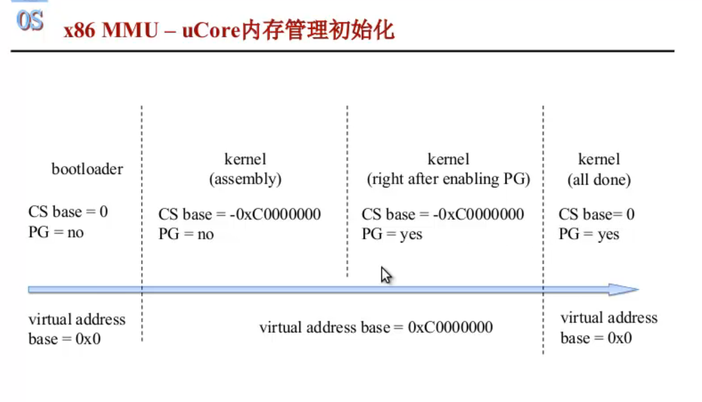

## x86的段页机制流程:

### 段机制

* GDT/LDT: 全局/局部段描述符表, 存在内存中, 表的起始地址和表大小保存在GDTR/LDTR中

* 段寄存器(96位): 程序员可见部分:保存段选择子(16位)和程序员不可见部分:段描述符(64位)
* 段选择子(16位): 
  * index: 用于查GDT/LDT, 确定一个段描述符, 再将查出的段描述符信息缓存在段寄存器中; 
  * TI: 标识GDT还是LDT, ucore中只使用了GDT
  * RPL/CPL: 代码段寄存器CS的这个字段填RPL, DS/ES等数据段寄存器的这个字段填RPL, 用于特权级检查/切换
* 段描述符: GDT/LDT的一条表项
  * base address和limit: 确定段在内存中的位置
  * DPL: 段描述符特权级, 用于特权级检查

**段选择子的结构**:


**段描述符的结构:**


### 页机制

**页目录项/页表项的结构:**


* 页表/物理页基地址：用于指定页表/物理页的基地址。

* P位（Present）：表示该页表项对应的页是否在物理内存中存在。如果P位为1，则表示该页存在；如果P位为0，则表示该页不存在，可能因为被换出到磁盘或尚未分配。
* R/W位（Read/Write）：用于指示对该页的读和写权限。如果R/W位为1，则表示该页可以被读写；如果R/W位为0，则表示该页只能被读取。
* U/S位（User/Supervisor）：用于指示对该页的访问权限级别。如果U/S位为1，则表示该页可以被用户态和系统态访问；如果U/S位为0，则表示该页只能被系统态访问。

* A位（Accessed）：表示该页是否被访问过。当处理器访问该页时，硬件会自动将A位设置为1，用于页替换算法和性能优化。

* D位（Dirty）：表示该页是否被写入过。当处理器写入该页时，硬件会自动将D位设置为1，用于页替换算法和性能优化。

* G位（Global）：用于全局页表。如果G位为1，则表示该页表项是全局的，可以在TLB（Translation Lookaside Buffer）中被共享，无需刷新TLB。

* AVL位（Available）：供软件使用的额外位，用于存储附加信息，如缓存标记等。


**如何开启页机制:** 

将CR0寄存器的PG（Page Global）位置1


### 段页式

**段式**: 粒度大, 容易实现段与段的安全检查和共享. 段与段之间可以不连续, 但段内必须连续

**页式**: 粒度小, 方便进行非连续内存分配. 通过多级页表减小页表内存占用, TLB缓存页表项, 通过页面置换实现虚拟内存.

**ucore的段页式**: 只使用了GDT. 根据逻辑地址的段选择子和段内offset算出线性地址. 根据线性地址的若干级页表号和物理地址offset算出物理地址.

**linux的段页式**: // todo:不确定. GDT保存了所有进程和任务的段描述符, 每个段描述符指向一个进程的LDT基址. LDT内部划分为代码段, 数据段, 堆段, 栈段等等. 以CS:EIP为例, 通过CS中的段选择子找到LDT中的段基地址, 再加上EIP的段内偏移, 找到线性地址空间中的一个线性地址. 线性地址划分为若干级页表的表号和物理页帧的offset, 最终转换为物理地址

段页式: 结合了二者的优点, 通过段机制提供了更细粒度的内存保护和权限控制，同时通过页机制实现了虚拟内存的地址映射和页面置换等功能。


#### 为何重页轻段? 为何不只用段或者页?

[可以看在这个文档](https://chyyuu.gitbooks.io/ucore_os_docs/content/lab2/lab2_3_3_5_4_maping_relations.html)



类似arm只有页机制，但x86为了向下兼容，段机制不能丢掉，最终状态是段基地址为0，主要靠页机制。但在这之前，必须先依靠段机制作为过渡


#### 逻辑地址->物理地址的过程:

1. 逻辑地址通过段机制->线性地址

逻辑地址以段寄存器:通用寄存器的方式保存,例如CS:EIP表示下一条要执行指令的地址, DS:EAX表示要访问的内存单元的地址. 利用CS的段选择子和EIP的段内offset, 可以转换为线性地址

2. 线性地址通过页机制->物理地址

线性地址通过多级页表转换为物理地址, ucore使用2级页表, linux最多支持5级页表, 第一级页表查出的是下一级页表的起始地址...最后一级页表查出的物理页帧号;

使用多级页表可以降低页表的内存占用: 利用页表项的存在位, 可以剪枝, 没必要将整个地址空间的页表项都建立出来


**cache:** 可以看到, 整个地址转换过程中涉及到多次访存, 为了提交效率, 做了很多次cache

1. 段机制: 将段描述符缓存在段寄存器CS中(这部分是程序员不可见的)
2. 页机制: 将页表项缓存在TLB中


## 特权级检查(CPL, RPL, DPL)

* 请求方:
  * 数据段选择子(DS, ES, FS, GS): 最低两位字段RPL(请求特权级), 指以什么权限访问该段
  * 代码段选择子(CS): 最低两位字段CPL(当前特权级): 指以什么权限执行当前指令
* 被请求方:
  * 段描述符表: DPL(段描述符或门描述符) 访问该段所需的最低权限
* RPL和CPL一起, 和段描述符中的DPL比较. 如果没通过特权级检查, 会产生General Protection Fault异常


## 特权级切换

**知识点**：

* x86提供了多种方法切换特权级, ucore中使用中断来完成;

* 每个特权级对应一个栈: ring3的用户栈, ring0的内核栈;

* 产生中断后, 在执行中断服务例程之前, 硬件会在内核ring0栈中压入被打断程序的上下文信息, 通常包括:
  * 堆栈位置(SS和ESP), 
  * 下一条执行的指令地址(CS(CPL), EIP),
  * 一系列标志(EFLAGS)); 

* 执行iret指令后, 硬件会弹出ring0栈中的信息, 用于恢复上下文环境

* TSS: GDT中保存了TSS段描述符，指出了TSS段的位置。TSS中保存了ring0~3的栈位置(ss和esp), 用于协助实现特权级切换


**ring0 <-> ring3:**

* 从ring0 -> ring3: 在ring0**伪造**一个能返回到ring3的栈, 使用iret指令将伪造的信息恢复到上下文环境中

解释: 假如在ring3执行, 产生一个中断, 就会在ring0栈中压入ring3执行的上下文信息. 那么在内核的ring0栈中, 伪造一个ring3由于中断进入ring0的现场(RPL=3, CPL=3), 然后执行iret指令, iret会将ring0中伪造的这些信息恢复到上下文寄存器中, 就成功切换到了ring3以特权级3去接着执行


* 从ring3 -> ring0: 修改内核ring0栈, 我们想回到哪个状态, 就修改到那个状态, 运行iret指令后, 硬件会根据ring0栈中伪造的信息恢复环境

解释: 在ring3执行过程中, 如果产生中断, 硬件会自动在ring0栈添加ring3被打断处的上下文信息. 中断处理例程执行结束后, iret指令会将ring0保存的上下文信息恢复到环境中, 就可以接着在ring3执行. 如果不想返回ring3, 可以修改ring0栈中添加的那些信息, 那么iret指令就会根据伪造的信息恢复环境, 进而接着留在ring0运行 


## 逻辑地址生成:

* .c -> 编译 -> 汇编 -> 链接 -> 加载(重定向) -> 逻辑地址

```c
.c: foo();
.S: jmp _foo
.o: jmp 75
.exe: jmp 175
加载到内存: jmp 1175
```


## 物理地址空间布局

```cpp
+----------------------+ <- 0xFFFFFFFF(4GB)       ----------------------------  4GB
|  一些保留内存，用于      |                                保留空间
|   32bit设备映射空间等   |
+----------------------+ <- 实际物理内存空间结束地址 ----------------------------
|                      |
|                      |
|     用于分配的         |                                 可用的空间
|    空闲内存区域        |
|                      |
|                      |
|                      |
+----------------------+ <- 空闲内存起始地址      ----------------------------  
|     Pages[]存放位置      |                    所有物理页帧数组Pages[]存放的空间 (4MB左右)
+----------------------+ <- bss段结束处           ----------------------------
|uCore的text、data、bss |                                  uCore各段的空间
+----------------------+ <- 0x00100000(1MB)       ---------------------------- 1MB
|       BIOS ROM       |
+----------------------+ <- 0x000F0000(960KB)
|     16bit设备扩展ROM  |                                 显存与其他ROM映射的空间
+----------------------+ <- 0x000C0000(768KB)
|     CGA显存空间       |
+----------------------+ <- 0x000B8000            ---------------------------- 736KB
|        空闲内存       |
+----------------------+ <- 0x00011000(+4KB)            uCore header的内存空间
| uCore的ELF header数据 |
+----------------------+ <-0x00010000             ---------------------------- 64KB
|       空闲内存        |
+----------------------+ <- 基于bootloader的大小              bootloader的
|      bootloader的   |                                       内存空间
|     text段和data段    |
+----------------------+ <- 0x00007C00            ---------------------------- 31KB
|   bootloader和uCore  |
|      共用的栈       |                                      栈的内存空间
+----------------------+ <- 基于栈的使用情况
|     低地址空闲空间    |
+----------------------+ <-  0x00000000           ---------------------------- 0KB

```


## 物理内存分配算法：

1. first-fit, best-fit, worst-fit
2. 伙伴系统（buddysystem）-> slub物理内存分配算法

  * 第一层： 初始时只有一块空闲块, 大小为u=2的幂. 当u>=需求的2倍时, 就等分u, 互相作为伙伴. 等程序释放时, 若伙伴此时也空闲, 就和伙伴合并起来得到更大的2的幂大小的空闲块
  * 第二层： 上一层已经实现了2的幂大小的物理内存分配，但会存在碎片问题。考虑到任意整数n的二进制表示是唯一的，因此可以在本层组装，达到分配任意内存的目的


## 页面置换算法：

基于数据结构Page的全局变量pages[], 表示所有的物理页，pages[i]表示i号物理页帧

将Page按照某种策略进行维护，可以实现对应的页面置换算法，例如若在Page中维护该物理页的最近一次访问时间+物理页的哈希表，可以实现LRU

常见的消极置换算法（FIFO, LRU， LFU, CLOCK），都是等到没有空闲物理页帧了才去置换，显然性能不够好。

因此仿照linux，在ucore中实现了一种积极置换算法，维持每个进程拥有的空闲物理页数目


