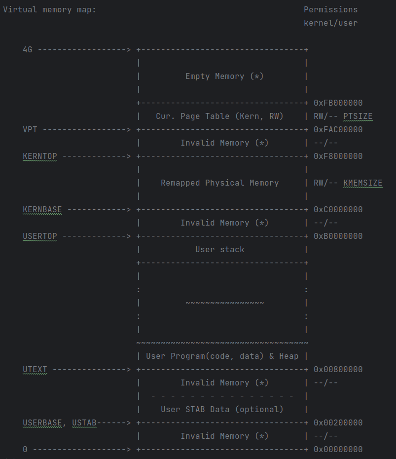

# 进程管理：

建立用户代码段、数据段 -> 创建内核线程 -> 创建用户进程的壳（PCB）-> 填写用户进程的肉（进程中的可执行程序） -> 执行用户进程 -> 完成系统调用 -> 结束用户进程

## 加载(dp_execv)： 

先删除

## 复制(dp_fork):
    
## 生命周期：

## 系统调用：

# 内存管理：

## 虚拟内存布局：

* 内核： [0xC0000000, 0xFFFFFFFF]

    * 页表: [0xFAC00000, 0xFB000000]用于存储该进程虚拟地址空间的页目录表和页表，整个地址空间需要映射的部分只有大约2433MB（有些无效内存无需映射），对应需要610个页表，该区域刚好可以放下这么多页表

    * 虚拟地址[0xC0000000, 0xF8000000]与物理地址[0, 0x38000000]形成对等映射，存储内核的代码段，数据段，内核栈，IDT, GDT等等的各种内核数据结构

* 用户： [0, 0xC0000000]

    * 用户栈和堆,数据段（.bss, .data, .rdata），代码段: [0xB0000000, 0x00800000]
    * 调试信息（符号表）: [0x00200000, 0x00800000]

注意： 
    
    "Invalid Memory"不会被映射到物理内存，如果用户试图访问这些区域，会产生段错误，并由操作系统在对应的中断处理例程中进一步处理，通常会终止程序，报告错误信息

    "Empty Memory"一般也不映射，但如果有需要，用户也可以用

## 如何将一个ELF格式的二进程可执行程序加载到进程中执行？

## 系统调用

* syscall是内核程序为用户程序提供内核服务的一种方式。 所有系统调用都使用IDT中的0x80号中断，其中断描述符中的字段DPL设置为3，表示可以以用户态主动触发该中断，这就是为什么用户态可以通过系统调用主动请求OS服务的原因；
* 当用户态程序发出一个系统调用时，查找IDT中的0x80对应的中断描述符, 根据其中的段选择子+段内offset确定中断处理例程的入口地址, 跳过去执行
* 为了正确返回用户态, 先保存用户态的trapframe. 再根据不同的系统调用，最终转化为syscall(系统调用号，若干参数), 执行不同功能的内核syscall函数
* 系统调用结束后，根据trapframe中保存的信息返回用户态

## 进程切换？

在Linux操作系统中，每个进程都有一个对应的task_struct结构体，其中保存了进程的状态信息、时间片、进程优先级、进程内存管理信息等。
在进程执行过程中，每产生一次时钟中断，操作系统会将当前进程的时间片减1，并检查它是否已经用完了时间片。
如果当前进程的时间片已经用完，操作系统会将该进程的状态设置为就绪状态，并将其insert就绪队列，同时将need_resched标记设置为1。

每次中断执行结束时，操作系统会检查need_resched标记。如果标记为1，说明当前进程已经用完了时间片，需要切一个换新进程。
操作系统会调用schedule函数来进行进程切换，根据进程调度算法选择一个新的进程执行。
    从就绪队列中取一个进程，设置need_schedule标记为1. 在TSS中设置ring0和ring3的栈地址；通过lcr3指令切换页表；切换上下文（ 汇编写的：先保存前一个进程的上下文，再把新进程的恢复到环境中）；以上工作通过屏蔽中断的方式保证原子性（cli和sti）
等到schedule函数返回时，中断处理程序也就结束了，CPU开始执行新的进程的代码。

## fork的过程？以及COW？

