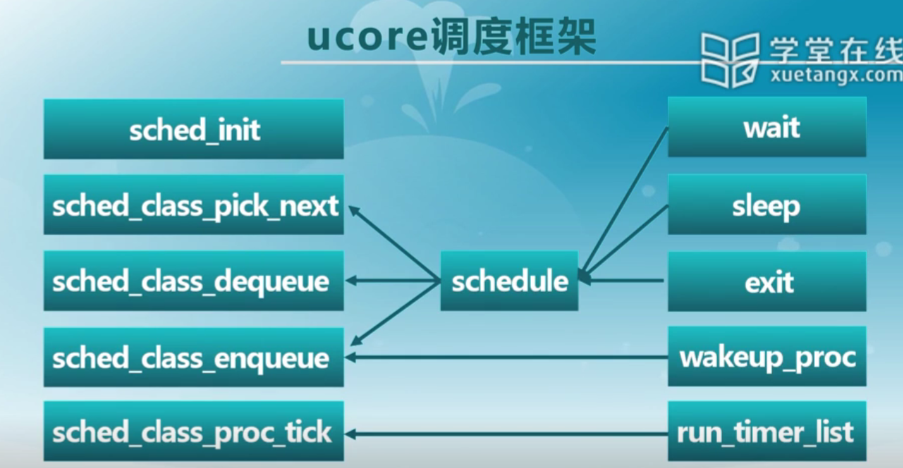

## 调度的时机：

* 一个进程从就绪动态变成阻塞态
* 进程退出了
* 进程的时间片用完了，在时钟中断弹出trapframe之前，检测current->need_resched=1则schedule()

## 调度需要考虑的问题：

* 选择哪个进程/线程？
* 选择哪个核？

## ucore的调度框架

## 抢占性：

用户进程是可抢占的；

内核执行是不可抢占的；

何时或何事件发生后需要调度？
何时或何事件发生后需要调整实现调度算法所涉及的参数？
如果基于调度框架设计具体的调度算法？
如果灵活应用链表等数据结构管理进程调度？